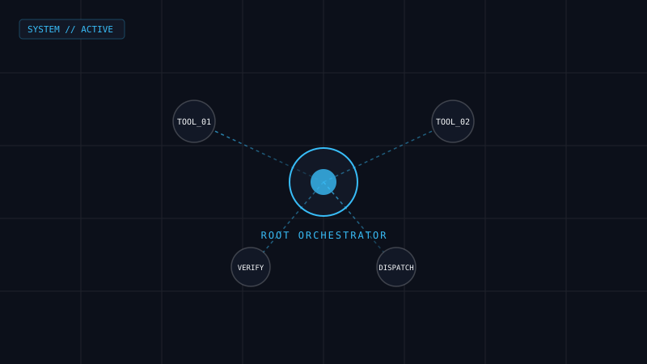
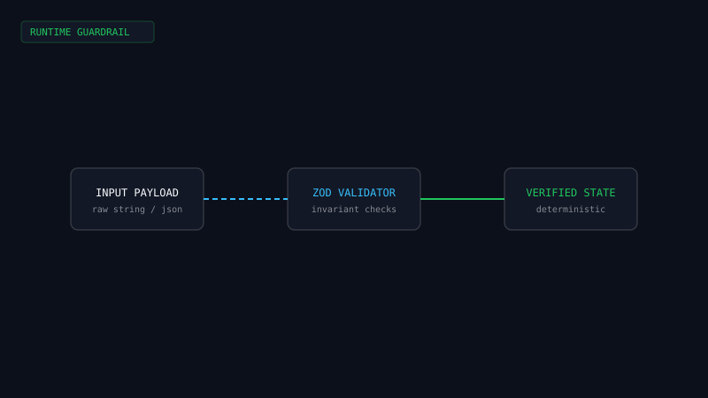

<div align="center">

# Obsidian & Atmosphere — The Tech Dossier

**Editorial Precision & Warm Atmosphere**  
*A personal portfolio and dynamic content management system engineered for an AI Orchestrator & Systems Engineer.*

[](https://portofolio-a7n03uyyy-jovankasuryad58296-7922s-projects.vercel.app/)
[](https://nextjs.org/)
[](https://www.typescriptlang.org/)
[](https://tailwindcss.com/)
[](https://supabase.com/)
[](LICENSE)

[Fitur Utama](#-fitur-utama) • [Preview Visual](#-preview-visual) • [Arsitektur & Keputusan Desain](#-arsitektur--keputusan-desain) • [Instalasi](#-instalasi--quick-start) • [Dokumentasi Lengkap](#-dokumentasi-lengkap)

---

</div>

## 📌 Ringkasan Proyek

Kebanyakan portofolio teknologi modern berada di dua kutub ekstrem: template bertema *neon sci-fi* gelap dengan animasi 3D berat yang memperlambat waktu muat, atau situs web statis kaku yang menuntut *re-deployment* kode hanya untuk memperbarui satu sertifikat.

**Obsidian & Atmosphere** dirancang sebagai alternatif berorientasi editorial:
1. **Estetika Editorial Hangat (`#f4f0e8`)**: Mengedepankan tipografi serif berbobot, aksen terracotta (`#bd4b2a`), dan kontras tinggi yang ramah pembaca (memenuhi standar WCAG AA).
2. **Performa Ringan**: Menghilangkan dependensi WebGL/Three.js yang berat, mereduksi bundle JavaScript awal hingga ~87 kB dengan skor Core Web Vitals optimal.
3. **Dossier Control (Headless CMS Terintegrasi)**: Mengelola proyek portofolio, sertifikasi terverifikasi, dan profil publik secara *real-time* via Supabase dengan perlindungan otentikasi tingkat server.

---

## 📸 Preview Visual

Bagian ini menampilkan antarmuka publik dan konsol manajemen sistem.

| Tampilan Publik (Editorial Dossier) | Konsol Admin Terminal (`/dossier-control`) |
| :---: | :---: |
|  |  |
| *Antarmuka kurasi proyek editorial dengan tipografi berbobot.* | *Gerbang autentikasi bergaya terminal dengan Cyber Macro Bar.* |

> [!TIP]
> **Panduan Penempatan Tangkapan Layar (Screenshot / GIF):**
> Untuk memperbarui tangkapan layar di repositori GitHub Anda:
> 1. Simpan gambar tangkapan layar Anda di folder `public/images/` atau `docs/assets/`.
> 2. Format yang direkomendasikan:
>    - `docs/assets/hero-preview.png` (Resolusi 1920x1080 atau 1440x900, kompresi WebP/PNG).
>    - `docs/assets/admin-terminal.gif` atau `.png` (Resolusi 1280x720 untuk demonstrasi otentikasi).
>    - `docs/assets/credential-modal.png` (Menampilkan modal bukti sertifikat).
> 3. Perbarui tautan gambar pada tabel di atas agar mengarah ke berkas tangkapan layar yang telah disimpan.

---

## ✨ Fitur Utama

- 🎨 **Anti-Slop Editorial Design System**: Desain bertata letak asimetris yang bebas dari pola AI generik. Menggunakan palet token terkalibrasi (`styles/tokens.css`) dengan kontras rasio di atas 4.5:1.
- 💻 **Terminal-Based Admin Gateway (`/dossier-control`)**: Autentikasi berbasis command-line shell dengan proteksi brute-force server-side (maksimal 3 percobaan gagal sebelum penguncian 5 menit) dan cookie sesi HMAC-SHA256 via `iron-session`.
- 📱 **Cyber Macro Bar**: Akses cepat perintah terminal yang dioptimalkan untuk perangkat layar sentuh dan mobile.
- 🗄️ **Dossier Control Panel**: Panel kontrol lengkap (CRUD) untuk memperbarui data halaman beranda, kartu proyek, dan kredensial tanpa perlu git commit atau redeploy.
- 📜 **Verifiable Credential Modals**: Dialog pop-up aksesibel dengan penguncian scroll latar belakang dan tautan verifikasi bukti kredensial digital.
- 🛡️ **Resilient Offline / In-Memory Fallback**: Saat variabel lingkungan Supabase belum disetel pada lingkungan lokal, aplikasi secara otomatis beralih ke data fallback in-memory (`shared/constants/defaults.ts`) sehingga antarmuka tetap dapat diuji tanpa gangguan.

---

## 🏗️ Arsitektur & Keputusan Desain

Sistem dibangun di atas fondasi **Next.js 14 App Router** dan **Supabase PostgreSQL** dengan pemisahan tanggung jawab yang terstruktur rapi:

```
┌─────────────────────────────────┐          ┌───────────────────────────────┐
│        CLIENT (Browser)         │          │     VERCEL EDGE / RUNTIME     │
│   Next.js 14 App Router (CSR)   │◄────────►│   Proxy / Middleware Guard    │
│   Tailwind Editorial Tokens     │          │   Server Actions (Zod Validate│
└────────────────┬────────────────┘          └───────────────┬───────────────┘
                 │                                           │
                 ▼                                           ▼
         Static / ISR Cache                          ┌───────────────┐
        (Halaman Publik /)                           │   SUPABASE    │
                                                     │ Postgres RLS  │
                                                     │ Asset Storage │
                                                     └───────────────┘
```

### Poin Pembelajaran Kunci & Keputusan Arsitektur (ADR Summary)

| Keputusan Arsitektur | Alternatif yang Dipertimbangkan | Alasan Pemilihan & Hasil |
|---|---|---|
| **Editorial CSS murni vs 3D Canvas** | Three.js / React Three Fiber | Menghilangkan beban komputasi GPU dan aset 3D (~400 kB), menghasilkan bundle JS awal 87 kB dan rendering instan di perangkat hemat daya. |
| **Server Actions + Iron Session** | NextAuth / Auth0 / Supabase Auth UI | Mengurangi dependensi eksternal untuk satu akun admin tunggal; otentikasi berlangsung aman melalui cookie httpOnly terenkripsi tanpa eksposur client-side state. |
| **Zod Schema Validation pada Server** | Validasi manual di handler | Memastikan input form pada proyek dan kredensial tervalidasi ketat secara deklaratif sebelum menyentuh lapisan database. |
| **PostgreSQL RLS (Row Level Security)** | Security di tingkat aplikasi saja | Kebijakan akses database terisolasi: kunci `anon` publik hanya dapat membaca data published (`SELECT`), sedangkan mutasi (`INSERT`, `UPDATE`, `DELETE`) dilindungi oleh otentikasi terverifikasi. |

---

## 🛠️ Tech Stack

- **Core Framework**: [Next.js 14](https://nextjs.org/) (App Router, Server Actions)
- **Language**: [TypeScript 5](https://www.typescriptlang.org/) (Strict Mode)
- **Styling**: [Tailwind CSS 3](https://tailwindcss.com/) & Vanilla CSS Design Tokens
- **Database & Storage**: [Supabase](https://supabase.com/) (PostgreSQL dengan RLS & Buckets)
- **Authentication**: [Iron Session](https://github.com/vvo/iron-session) + [Bcryptjs](https://github.com/dcodeIO/bcrypt.js)
- **Icons**: [Lucide React](https://lucide.dev/) (Stroke 1.5px konsisten)
- **Testing**: [Vitest](https://vitest.dev/) & React Testing Library
- **Deployment**: [Vercel](https://vercel.com/)

---

## 🚀 Instalasi & Quick Start

Ikuti langkah-langkah berikut untuk menjalankan repositori ini di lingkungan lokal Anda.

### 1. Prasyarat Sistem
- Node.js versi 18.17.0 atau lebih baru
- npm, pnpm, atau yarn

### 2. Kloning Repositori
```bash
git clone https://github.com/jovankasd/portofolio.git
cd portofolio
```

### 3. Instalasi Dependensi
```bash
npm install
```

### 4. Konfigurasi Environment Variables
Salin berkas contoh konfigurasi:
```bash
cp .env.local.example .env.local
```

Buka `.env.local` dan lengkapi variabel berikut:
```env
# Supabase (Publik)
NEXT_PUBLIC_SUPABASE_URL=https://your-project-ref.supabase.co
NEXT_PUBLIC_SUPABASE_ANON_KEY=your-anon-key-here

# Supabase (Server-side Only)
SUPABASE_SERVICE_ROLE_KEY=your-service-role-key-here

# Admin Master Key Hash (Bcrypt hash)
ADMIN_MASTER_KEY_HASH=$2b$12$...

# Admin Session Secret (String acak 32 karakter)
ADMIN_SESSION_SECRET=your-32-char-random-hex-string-here

# URL Aplikasi
NEXT_PUBLIC_APP_URL=http://localhost:3000
```

> [!NOTE]
> **Cara menghasilkan hash dan token rahasia secara cepat:**
> - Generate Bcrypt Hash untuk password admin:
>   ```bash
>   node -e "require('bcryptjs').hash('PASSWORD_ANDA', 12).then(console.log)"
>   ```
> - Generate random 32-character hex untuk `ADMIN_SESSION_SECRET`:
>   ```bash
>   node -e "console.log(require('crypto').randomBytes(32).toString('hex'))"
>   ```

### 5. Inisialisasi Database (Opsional jika menggunakan Supabase)
Jalankan query DDL yang tersedia di berkas [`supabase/schema.sql`](supabase/schema.sql) pada SQL Editor di dasbor Supabase Anda untuk membuat tabel `pages`, `projects`, `credentials`, dan konfigurasi Row Level Security (RLS).

### 6. Menjalankan Server Pengembangan
```bash
npm run dev
```

Buka [http://localhost:3000](http://localhost:3000) pada peramban Anda.  
Akses gerbang admin di [http://localhost:3000/dossier-control](http://localhost:3000/dossier-control).

---

## 📋 Perintah yang Tersedia

| Perintah | Deskripsi |
| :--- | :--- |
| `npm run dev` | Menjalankan Next.js development server pada port 3000 |
| `npm run build` | Melakukan kompilasi dan optimasi bundle untuk produksi |
| `npm run start` | Menjalankan server Next.js mode produksi |
| `npm run lint` | Menjalankan linter ESLint untuk memeriksa standar kode |
| `npm run test` | Menjalankan unit test dengan Vitest |

---

## 📁 Struktur Direktori

```text
portofolio/
├── app/                      # Rute App Router (Halaman publik, admin, API)
│   ├── page.tsx              # Beranda portofolio editorial publik
│   ├── dossier-control/      # Gerbang login terminal dan dasbor CMS
│   └── layout.tsx            # Root layout & font configuration
├── components/               # Komponen antarmuka modular
│   ├── ui/                   # Komponen publik (Navbar, ProjectCard, Modal)
│   ├── admin/                # Komponen CMS (TerminalShell, MacroBar, Forms)
│   └── shared/               # Komponen lintas halaman
├── server/                   # Lapisan backend terisolasi
│   ├── actions/              # Next.js Server Actions (Auth, Projects, Credentials)
│   ├── auth/                 # Sesi enkripsi iron-session & rate-limiting
│   ├── db/                   # Supabase client, queries, dan tipe data
│   └── services/             # Validasi input berbasis Zod schemas
├── shared/                   # Tipe data, utilitas, dan fallback in-memory
├── config/                   # Validasi runtime environment variable
├── docs/                     # Dokumentasi arsitektur, PRD, dan design tokens
├── public/                   # Berkas statis publik (SVG, sertifikat, aset)
├── styles/                   # Desain token editorial terpusat (tokens.css)
└── supabase/                 # Skema DDL SQL dan setup database
```

---

## 📚 Dokumentasi Lengkap

Dokumentasi teknis mendalam telah disediakan di direktori [`docs/`](docs/):
- [**Arsitektur Sistem (ARCHITECTURE.md)**](docs/ARCHITECTURE.md): Alur data, mitigasi keamanan, dan rasionalisasi teknis.
- [**Product Requirement Document (PRD.md)**](docs/PRD.md): Visi produk, profil pengguna, dan spesifikasi fitur.
- [**Design System Specification (DESIGN.md)**](docs/DESIGN.md): Panduan warna, tipografi, dan filosofi anti-slop.
- [**Setup Backend & Supabase (BACKEND_SETUP.md)**](docs/BACKEND_SETUP.md): Panduan skema database, storage bucket, dan aturan RLS.

---

## 📄 Lisensi

Proyek ini dirilis di bawah lisensi [MIT](LICENSE).

---

<div align="center">
  <sub>Dirancang dan dibangun dengan presisi teknik oleh <b>Jovanka Surya Dilla</b>.</sub>
</div>
